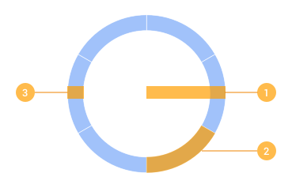
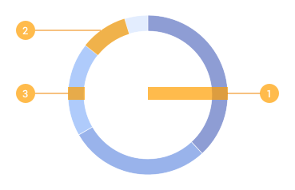
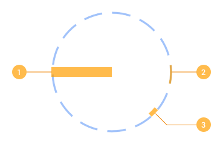

# Segmented circles
Saves hours by automatically creating precise circular graphics as areas or lines with custom segments for analytics, graphs and dashboards.

## Brand new version 2.0
Completely new plugin, now also supporting variable values pie chart segments, perfectly spaced dashed circles and tickmark circles.

## Description
### Create segmented circle

➊ Radius  ➋ Number of segments  ➌ Thickness

This is the base circle with a configurable number of segments and thickness.
Will be drawn as line segments if thickness is specified as 1. Remembers previously used values.

### Create variable segments circle

➊ Radius  ➋ Custom values  ➌ Thickness

A pie chart style segments circle with a configurable set of comma-separated values and thickness.
Will be drawn as line segments if thickness is specified as 1. Remembers previously used values.

### Create tickmarks circle

➊ Radius  ➋ Tick marks stroke width  ➌ Tick marks length

Tick marks circle with completely configurable major and minor tick marks.
Drawn as separate groups and easily configurable. Remembers previously used values.

### Create dashed circle

➊ Radius  ➋ Dash length  ➌ Gap length

For an evenly spaced dashed circle with dashes and spaces customizable (in px).
Will be drawn as line segments if thickness is specified as 1. Remembers previously used values.

Note: Some of these will allow to configure a bottom cut-out angle (in degrees). When specified to be other then 0, the segmented circle will render as open, with the opening at the bottom.

### Reset to defaults
Removes last used values and resets to defaults.

## How to install for Sketch (3.4 or higher supported)
Download the .zip file. Double click the .sketchplugin file inside it.

## License
(c)2016 German Bauer. All code covered by [this BSD 2-clause style license](./LICENSE.md)
